# Sentrix AI Core Architecture

> Enterprise-grade AI orchestration layer for the Sentrix Cybersecurity Platform.
> This document describes the architecture of the AI Core — the reasoning, planning, execution, and knowledge substrate that powers Sentrix's autonomous security operations. It is a design specification, not an implementation guide.

---

## 1. Vision

Sentrix is an AI operating system for cybersecurity. The AI Core is the "brain" of that operating system: a horizontally-scalable orchestration layer that lets security analysts converse with an autonomous reasoning system that can plan, execute tool-use, retrieve knowledge, verify outcomes, and produce auditable reports.

The AI Core is designed around four principles:

- **Explainable by default** — Every decision is traceable to a model, prompt, context window, tool output, and approval.
- **Human-in-the-loop where it matters** — Dangerous or irreversible actions require approval; safe actions proceed automatically.
- **Model-agnostic** — No single vendor lock-in. Models are interchangeable routers, planners, and executors.
- **Elastic and observable** — Built for millions of requests/day with per-request tracing, quotas, and graceful degradation.

---

## 2. AI Core Overview

The AI Core is a modular pipeline that transforms a natural-language security request into a verified, explainable, and optionally-executed outcome.

### High-Level Request Lifecycle

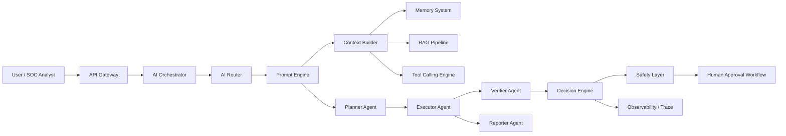

### Component Inventory

| Component | Responsibility | Scale Pattern |
|-----------|---------------|---------------|
| AI Orchestrator | Entry point, session lifecycle, fan-out/fan-in | Stateless workers + queue |
| AI Router | Model/provider selection, failover, cost routing | Stateless, cached weights |
| Prompt Engine | Template assembly, policy injection, sanitization | Stateless, template store |
| Context Builder | Assemble context from memory, RAG, tools, schema | Stateless, cached chunks |
| Memory System | Short/long-term episodic + semantic memory | Redis (short) + Postgres/Vector (long) |
| Tool Calling Engine | Tool discovery, authorization, execution, schema contract | Pooled executors, sandbox |
| Agent Layer | Planner / Executor / Verifier / Reporter | State-machine workers |
| RAG Pipeline | Ingestion, chunking, embedding, retrieval, re-rank | Async pipeline + vector index |
| Decision Engine | Gatekeeping, confidence scoring, policy enforcement | Stateless rules + model scoring |
| Safety Layer | Guardrails, redaction, PII detection, permission checks | Pre/post model hooks |
| Human Approval | Workflow engine for approval gates | Stateful workflow store |
| Observability | Traces, metrics, logs, evals | OpenTelemetry + analytics |

### Core Sequence

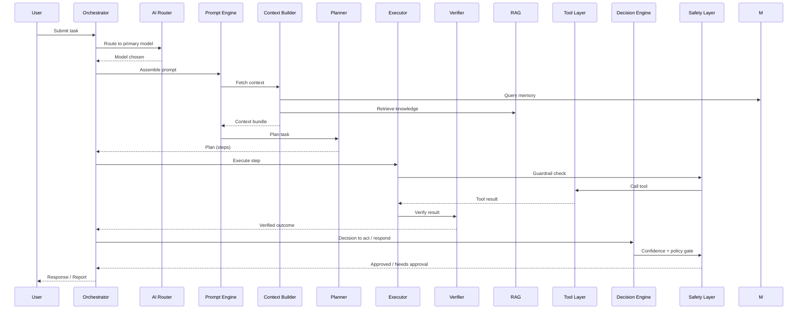

---

## 3. AI Router

The AI Router is the entry decision point that selects which model, provider, and configuration serves a request.

### Responsibilities

- Select primary and fallback models per request type (planning, tool-calling, RAG summarization, report generation).
- Enforce quotas, budgets, latency SLAs, and data-residency policy.
- Detect provider failures, rate limits, and degradation; fail over transparently.
- Route sensitive requests to compliant providers (e.g., on-prem/Ollama for regulated data).

### Routing Decision Flow

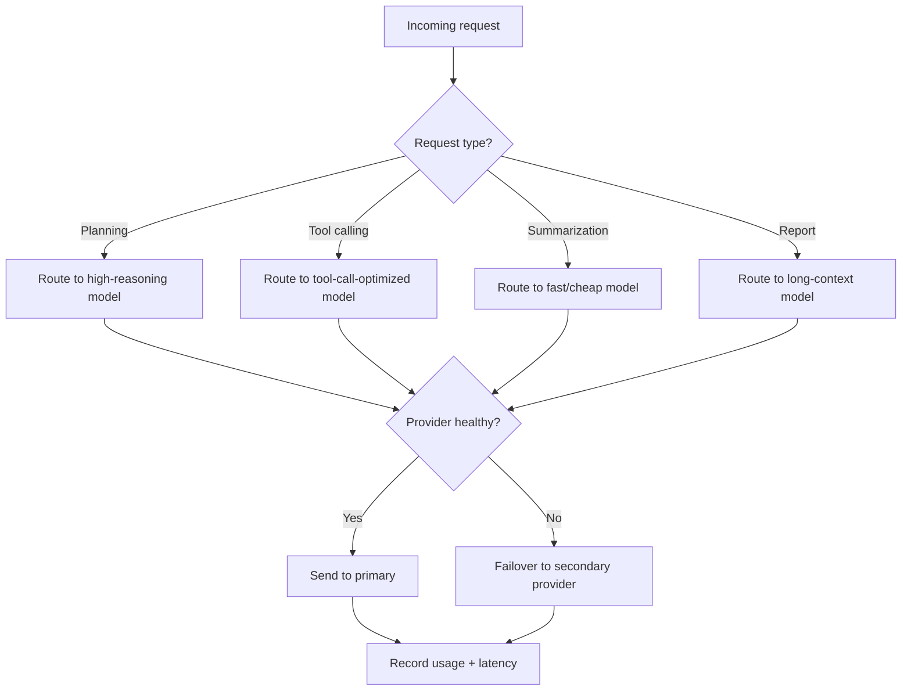

### Enterprise Scaling

- Router is stateless and horizontally scalable behind a load balancer.
- Routing policy is versioned and hot-reloadable (decisions are data, not code).
- A circuit breaker per provider-model pair prevents cascade failures.
- Per-tenant and per-tier routing policies support enterprise isolation.

---

## 4. Multi-Model Strategy

Sentrix is provider-agnostic. The AI Core abstracts models behind a uniform interface so models can be swapped, mixed, and routed based on the task.

### Supported Model Classes

- **Frontier reasoning models** — complex planning, multi-step reasoning, incident investigation.
- **Tool-calling models** — reliable structured function/tool invocation.
- **Fast/cheap models** — classification, triage, summarization, intent detection.
- **Local/on-prem models** — air-gapped environments, sensitive data, offline operations.
- **Embedding models** — retrieval quality, multilingual support.

### Strategy Matrix

| Strategy | Description | Use Case |
|----------|-------------|----------|
| Task routing | Different models per subtask | Planning vs. tool-calling vs. summary |
| Cascade fallback | Primary → secondary → tertiary | Provider outage or rate limit |
| Ensemble | Majority/confidence-weighted vote | High-stakes classification |
| Hybrid local/cloud | Privacy filter sends sensitive context to local only | Regulated enterprises |
| Model layering | Cheap model pre-filters, expensive model confirms | Cost optimization |

### Abstraction Contract

Every provider adapter exposes:

- Tokenization / context window limits
- Structured output (tool calls, JSON) capability
- Latency and cost profile
- Streaming support
- Legally permissible data-residency guarantees

---

## 5. Prompt Engine

The Prompt Engine assembles every prompt sent to a model. It guarantees consistency, safety, and explainability.

### Prompt Assembly Layers

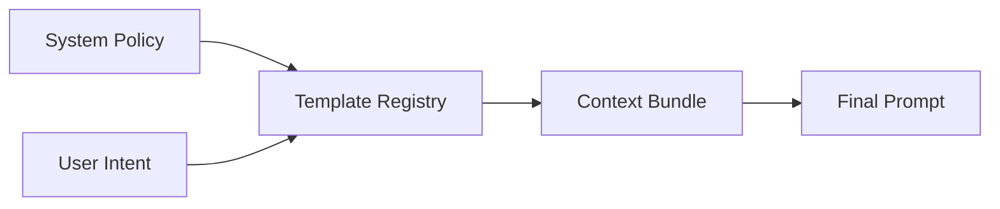

- **System Policy** — immutable enterprise guardrails, model instructions, output constraints.
- **Template Registry** — versioned templates per task (plan, execute, verify, report, summarize). No prompt is ever assembled ad hoc in agent code.
- **Context Bundle** — the sanitized, deduplicated, size-bounded context produced by the Context Builder.
- **Format Enforcement** — task-specific output schema instructions (JSON, markdown, structured report).

### Design Rules

- Prompts are versioned and diffable; changing a template is a tracked change.
- Prompt versions are recorded in every trace for reproducibility.
- Injection protection: user content and external data are isolated in delimited blocks flagged as "untrusted".
- Context windows are managed by the Context Builder, never by prompt concatenation in agent code.

---

## 6. Context Builder

The Context Builder assembles the minimal, relevant, and safe context for a model call.

### Input Sources

- Session and short-term memory
- Long-term memory (episodic/semantic)
- RAG retrieval results
- Tool outputs and schemas
- Enterprise knowledge and policies
- Prior messages in the conversation window

### Pipeline

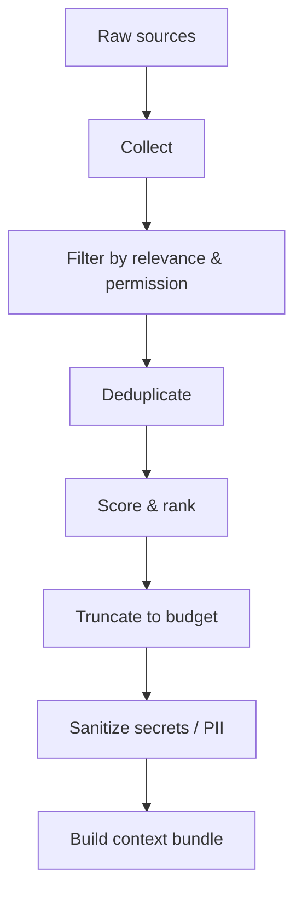

### Budgeting & Scaling

- Every model has a **context budget** (token allocation) that is centrally managed.
- Retrieval is paginated/streamed to avoid over-fetching.
- Context bundles are cached by hash when identical sub-queries recur (popular for repeated SOC workflows).
- Sensitive fields are redacted before entering the context bundle; the Safety Layer re-checks on output.

---

## 7. Memory System

Memory gives agents continuity across requests, sessions, and users while remaining privacy-safe.

### Memory Tiers

| Tier | Backing Store | Lifetime | Purpose |
|------|---------------|----------|---------|
| Working/Scratchpad | Redis (fast) | Per-run | Current task state, partial results |
| Short-term (episodic) | Redis / cache | Session | Conversation history, recent tool calls |
| Long-term (episodic) | PostgreSQL | Tenant-scoped | Past investigations, decisions, outcomes |
| Semantic | Vector DB | Tenant-scoped | Facts, playbooks, learned patterns |
| Procedural | Config store | Persistent | Playbooks, runbooks, approved workflows |

### Memory Flow

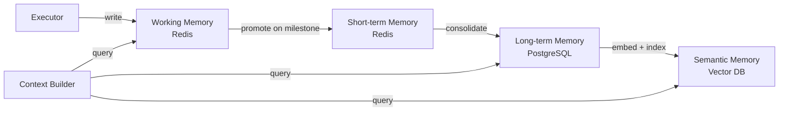

### Scaling & Privacy

- Tenant-scoped namespaces and row-level security prevent cross-tenant leakage.
- TTLs on short-term tiers bound compliance surface and storage cost.
- Memory writes are async and idempotent; reads are cached with bounded staleness.
- Memory compaction summarizes old episodes into reusable semantic facts.

---

## 8. Tool Calling Engine

The Tool Calling Engine is the bridge between AI reasoning and real security tooling (Nmap, Wireshark, Burp, Metasploit, Wazuh, etc.). It is a strict, authorized, sandboxed execution layer.

### Tool Execution Flow

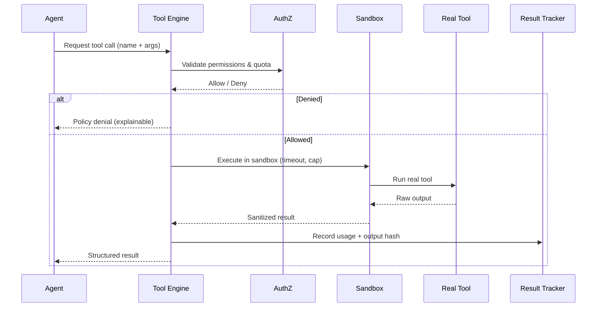

### Design Rules

- **Contract-first**: every tool exposes a versioned JSON Schema for arguments and outputs. Models only see the schema, never raw system interfaces.
- **Least privilege**: tools are scoped per tenant, per role, and per agent; approvals are cached but revocable.
- **Sandboxing**: all tool executions run with resource limits (CPU, memory, runtime), network egress policy, and no persistent state by default.
- **Idempotency**: destructive tools require unique run IDs and are never auto-retried.
- **Audit**: every invocation is recorded with requester, args hash, output hash, timestamps, and approval evidence.

---

## 9. Agent Communication Layer

Agents do not talk to each other directly. All communication flows through an asynchronous, traceable message backbone.

### Communication Topology

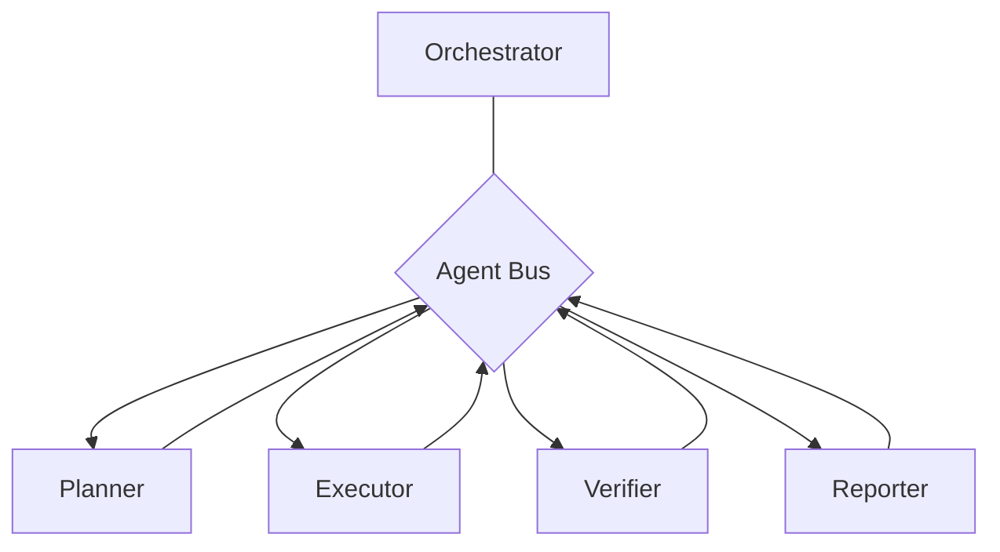

### Guarantees

- **Asynchronous**: agents exchange messages via queues/topics; no blocking point-to-point calls.
- **Correlation IDs**: every message chain carries a root run ID, enabling full reconstruction of an investigation.
- **Schema-validated**: every message type has a versioned schema (contract-first, like tools).
- **Backpressure & retries**: queues enforce limits; poison messages are dead-lettered for inspection.
- **Publish/subscribe**: events (e.g., "incident escalated", "tool executed") are published for other agents, the observability pipeline, and downstream integrations.

---

## 10. Planner Agent

The Planner decomposes a high-level goal into an executable, ordered, and reviewable plan.

### Responsibilities

- Interpret the user goal and available tools/knowledge.
- Produce a graph of steps: actions, tool calls, retrievals, conditionals, and approval gates.
- Estimate cost, latency, and risk per step.
- Rewrite plans when execution reveals new constraints.

### Plan Structure

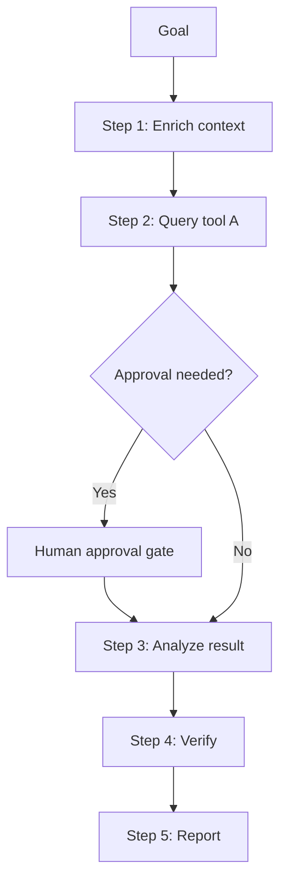

### Design Rules

- Plans are **not free-form**: they conform to a plan schema and are validated before execution.
- Every plan step records expected outcome, so the Verifier has a contract to check.
- The Planner never executes anything itself; it only produces plans.
- Plans are persisted and replayable for debugging and compliance.

---

## 11. Executor Agent

The Executor carries out the plan one step at a time, invoking tools and handling results under the supervision of the Safety Layer.

### Responsibilities

- Execute plan steps in dependency order.
- Invoke the Tool Calling Engine for tool steps.
- Invoke the Context Builder / RAG for knowledge steps.
- Merge partial results into working memory.
- Detect step failure, retry safely, or escalate.

### Execution Loop

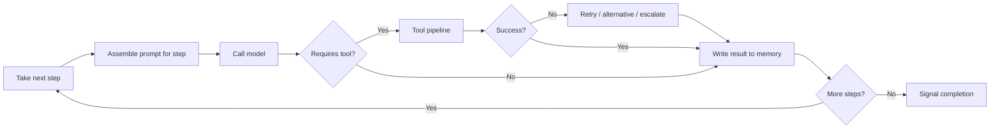

### Design Rules

- Executor is **stateless across runs**; all state lives in working memory (Redis).
- Each execution has a hard timeout and step budget to prevent runaway loops.
- The Executor cannot bypass the Safety Layer; model output is filtered before any tool call.

---

## 12. Verifier Agent

The Verifier checks that executed steps produced the expected, safe, and correct outcome before the decision engine proceeds.

### Verification Dimensions

| Dimension | Question |
|-----------|----------|
| Completeness | Did the step produce all required outputs? |
| Correctness | Does the result satisfy the plan step's contract? |
| Safety | Does the result conform to the Safety Layer's rules? |
| Provenance | Is the result attributable to a real tool run with a hash? |
| Consistency | Does the result align with memory and prior findings? |

### Verification Flow

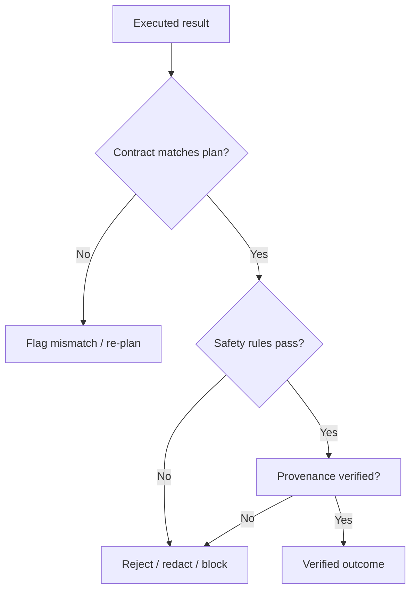

### Design Rules

- Verification can be model-based (reasoning check) or rule-based (schema/safety check); both are recorded.
- Low-confidence results are re-verified by a second model (ensemble) or escalated to a human.
- Verifier outputs feed directly into the Decision Engine's risk score.

---

## 13. Reporter Agent

The Reporter turns verified results into human-readable, role-appropriate, and audit-ready output.

### Responsibilities

- Generate executive summaries, technical write-ups, and compliance reports.
- Map findings to frameworks (MITRE ATT&CK, OWASP, NIST, CWE/CAPEC).
- Preserve evidence: tool outputs, timestamps, hashes, and decision lineage.
- Deliver reports via the channel the user requested (dashboard, PDF, email, ticketing system).

### Report Layers

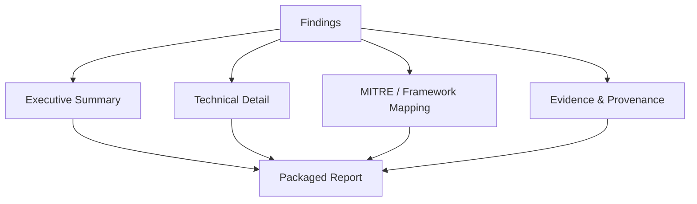

### Design Rules

- Reports are **deterministic artifacts** generated from structured findings, not free-form model output.
- Every claim in a report links back to a verified tool result or knowledge source.
- Report templates are versioned and localized (SOC teams, executives, auditors).
- Reports are immutable once published; corrections generate a new version.

---

## 14. RAG Pipeline

The RAG (Retrieval-Augmented Generation) Pipeline grounds AI answers in authoritative cybersecurity knowledge: MITRE ATT&CK, OWASP, NIST, CVE/CWE/CAPEC, vendor docs, and the enterprise knowledge base.

### End-to-End Pipeline

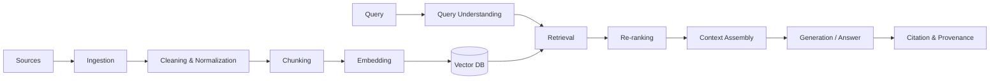

### Enterprise Features

- **Hybrid search**: vector similarity + keyword (BM25) + metadata filters (threat actor, CVE, technology stack).
- **Access-controlled retrieval**: tenants only retrieve documents they are permitted to see; access control is applied in the index and re-checked at assembly.
- **Freshness**: CVE/vendor docs refresh on schedules; ingestion is incremental and idempotent.
- **Grounded generation**: answers must cite retrieved chunks or be flagged as ungrounded (reduces hallucination).
- **Evaluation**: retrieval quality is scored offline (hit rate, MRR, faithfulness) and monitored online via feedback.

---

## 15. Knowledge Flow

Knowledge flows through Sentrix in three directions: ingestion, retrieval, and feedback.

### Knowledge Flow Diagram

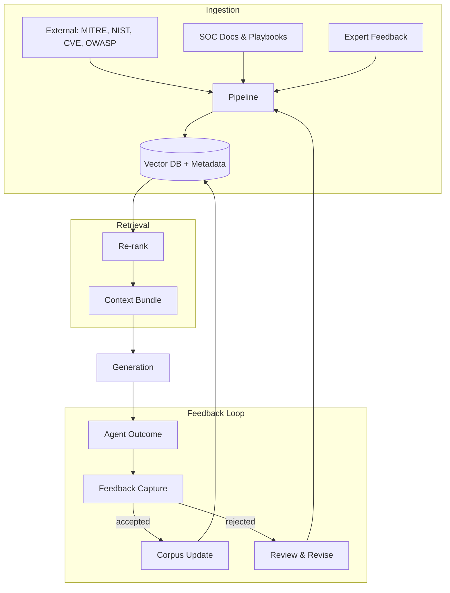

### Design Rules

- Knowledge is **versioned** per source; rollback is possible when a source update degrades quality.
- Every chunk stores provenance (source, version, ingestion timestamp, tenant visibility).
- Knowledge quality is a first-class metric: stale, duplicate, or contradicted chunks are flagged.
- Feedback (accepted/rejected answers) continuously retrains retrieval and prompt strategy.

---

## 16. Decision Engine

The Decision Engine decides what the system does with a verified outcome: respond, act automatically, ask for approval, or escalate.

### Decision Inputs

- Verifier confidence score and result contract
- Safety Layer risk classification
- Policy rules (tenant, role, action sensitivity)
- Human-in-the-loop thresholds

### Decision Flow

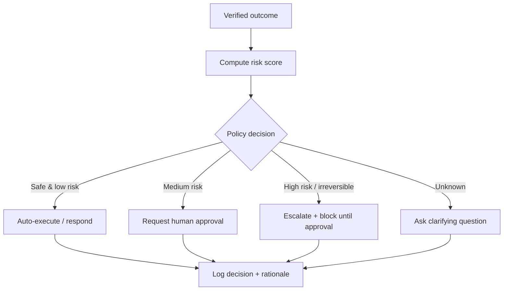

### Design Rules

- Decisions are **deterministic** when policy is unambiguous and confidence is high; model judgment is the default when policy is silent.
- Every decision record includes the inputs, confidence, policy version, and final disposition (audit-complete).
- Thresholds are configurable per tenant and per action class; defaults are conservative.
- The Decision Engine never triggers irreversible actions without a successful approval chain.

---

## 17. Safety Layer

The Safety Layer wraps every model input and output, and every tool invocation, with guardrails.

### Guardrail Categories

| Category | Examples |
|----------|----------|
| Content safety | Prompt injection, jailbreak, disallowed topics |
| Data protection | PII/secrets redaction, tenant isolation, residency routing |
| Action safety | Destructive command detection, sandbox requirements, approval triggers |
| Model hygiene | Output schema validation, hallucination flags, confidence gates |
| Regulatory | Audit completeness, retention policy, legal hold flags |

### Safety Positioning

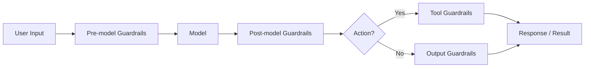

### Design Rules

- Guardrails are **layered and redundant**: a failure in one layer is caught by another.
- Guardrail violations are first-class events with their own traces and metrics.
- Safety rules are code + data: common patterns are data-driven, cannot be bypassed by prompt wording.
- In regulated deployments, output containing certain data classes is only released through approved channels.

---

## 18. Human Approval Workflow

Human approval is the mechanism that keeps humans in control of dangerous, expensive, or irreversible actions.

### Workflow

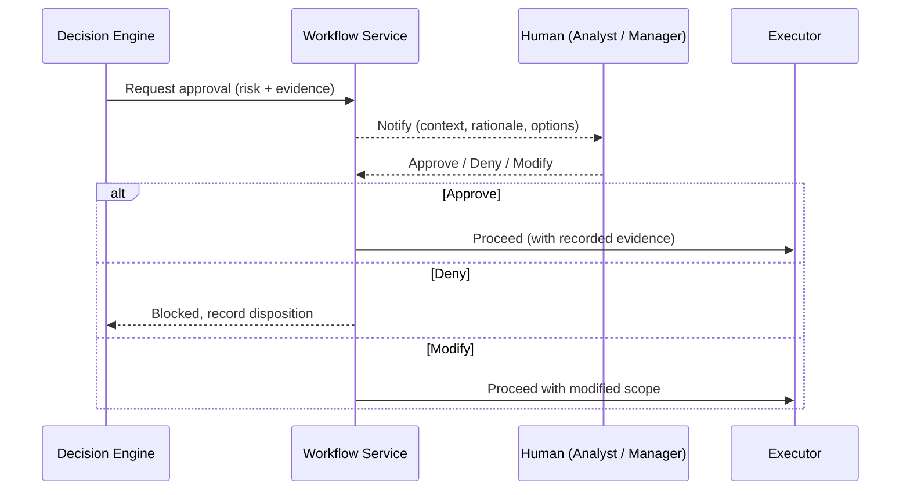

### Design Rules

- Approval requests are **context-complete**: action, risk, evidence, requester, and alternative options are shown without leaking secrets.
- Timeboxed: approvals expire; a stale approval never executes.
- Escalation matrices route requests (analyst → manager → security officer → legal) by tier.
- Full chain-of-custody is recorded: who approved, when, with what justification, bound to the run ID.
- Audit and compliance require approval data to be immutable and exportable.

---

## 19. Error Recovery

The AI Core assumes every dependency (model provider, tool, store) can fail; design favors graceful degradation.

### Failure Classes & Strategy

| Failure | Strategy |
|---------|----------|
| Model timeout / 429 / 5xx | Circuit breaker + cascade failover to secondary provider |
| Tool failure | Retry (idempotent only), alternative tool, or step re-plan |
| Retrieval failure | Return partial context; flag answer as ungrounded |
| Memory / store outage | Degrade to stateless mode; persist trace to local buffer |
| Poison message / malformed output | Dead-letter queue + schema re-validation |
| Approval service down | Fail closed for high-risk actions; queue low-risk |

### Recovery Flow

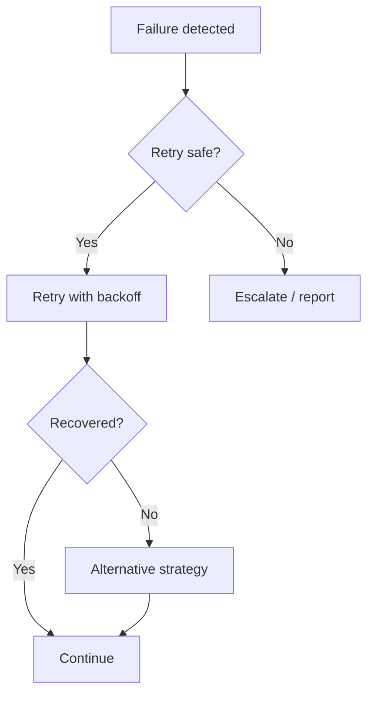

### Design Rules

- **Fail closed** for security-sensitive operations (no silent bypass).
- Timeouts, retry budgets, and backoff policies are per-component and bounded.
- All recovery decisions are logged with the root cause chain for post-incident review.
- The system degrades gracefully: non-critical beautification (summaries, formatting) is dropped before core function.

---

## 20. Observability

Enterprise-scale AI requires deep observability across models, agents, tools, and infrastructure.

### Three Pillars

| Pillar | What is captured |
|--------|------------------|
| Traces | Run ID → model calls → context → tool calls → decisions → approvals → reports |
| Metrics | Latency, token usage, cost, error rates, confidence distribution, provider health |
| Logs | Full request/response bodies (redacted), guardrail hits, retries, disruptions |

### Trace Telemetry

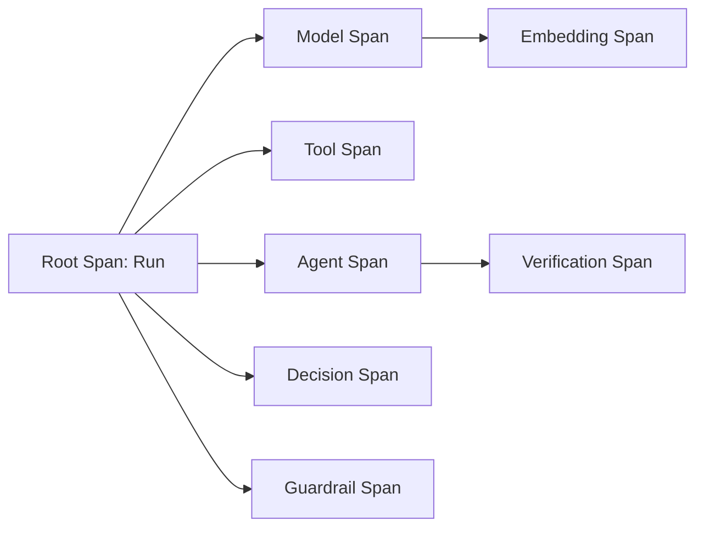

### Design Rules

- Every request has a **root correlation ID** propagated across web, API, agents, tools, and stores (OpenTelemetry W3C trace context).
- Prompt/model versions are attributes on every model span for reproducibility.
- Cost and token telemetry are first-class; budgets are enforced from the same metrics.
- Live dashboards (Grafana) and retention policies (Loki) keep data queryable at scale; sensitive payloads are redacted at the edge.

---

## 21. Future Expansion

The AI Core is designed to grow without re-architecture.

### Expansion Vectors

| Vector | Path |
|--------|------|
| Agent library | New specialized agents (SOC, Threat Hunting, DFIR, Red/Blue Team, Compliance, OSINT) plug into the Agent Bus |
| Tool ecosystem | New tools register via the schema contract; no engine changes |
| Model marketplace | Providers/deprecated models are added via the Router's data-driven policy |
| Knowledge sources | New corpora (vendor, threat intel feeds) flow through the existing RAG pipeline |
| Autonomous degrees | The Decision Engine's approval thresholds tighten/loosen per tenant maturity |
| Voice & multimodal | The Orchestrator accepts additional input modalities without changing the core pipeline |
| Cross-tenant federation | Shared intelligence across tenants with privacy-preserving aggregation |

### Architectural Non-Goals (Stability)

- No agent-to-agent hardcoded communication.
- No model-specific logic in business code.
- No prompt engineering scattered in application code.
- No tool invocations outside the Tool Calling Engine contract.

---

© Sentrix-M — AI Core Architecture (Design Specification)

