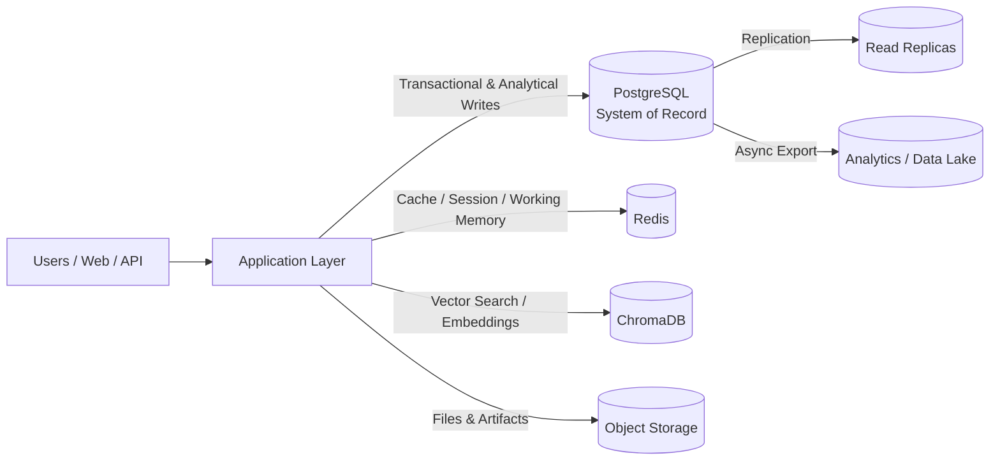
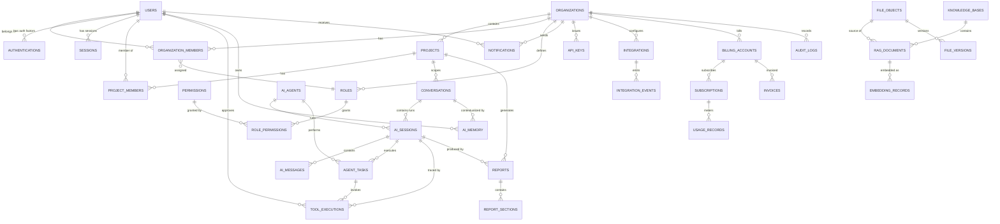

# Sentrix Database Architecture

> **Product:** Sentrix — Enterprise AI-Powered Cybersecurity Platform
> **Document:** Database Architecture Design Specification
> **Primary Database:** PostgreSQL
> **Cache / Session / Working Memory:** Redis
> **Vector Store:** ChromaDB
> **File Storage:** Object Storage (S3-compatible)
> **Audience:** Engineering, Data Platform, DevOps, Security

---

## 1. Database Vision

The database architecture is the backbone of Sentrix's enterprise SaaS platform. It is designed to:

- Support **millions of users** and **millions of requests/day** with horizontal and vertical scaling headroom.
- Enforce **row-level tenant isolation** so no tenant can ever read or mutate another tenant's data.
- Keep **transactional integrity** for security-critical workflows (cases, approvals, audit) while keeping **AI memory and knowledge retrieval** performant at massive scale.
- Honor a **polyglot-persistence principle**: PostgreSQL for relational truths, Redis for fast ephemeral state, ChromaDB for vectors, and object storage for files — each used for what it does best.
- Remain **audit-complete** and **retention-ready** for SOC 2, ISO 27001, GDPR, and HIPAA-style compliance.

---

## 2. Database Architecture

### 2.1 Storage Topology

| Store | Purpose | Data Held | Scaling |
|-------|---------|-----------|---------|
| **PostgreSQL** | System of record | Users, orgs, projects, conversations, sessions, messages, agents, tasks, tool executions, reports, KB metadata, RAG doc metadata, audit, notifications, API keys, integrations, billing, file metadata | Primary + read replicas; partitioning; connection pooling; future sharding |
| **Redis** | Fast ephemeral state | Sessions, rate limits, working memory for agents, short-term conversation cache, distributed locks, queue backpressure signals | Redis Enterprise / cluster mode; eviction policies |
| **ChromaDB** | Vector embeddings only | Embeddings + payload metadata for semantic retrieval | Distributed collection shards; replication |
| **Object Storage** | Files only | RAG source files, report exports, forensic artifacts, evidence, attachments, fine-tune datasets | S3-compatible; lifecycle policies |

### 2.2 High-Level Data Flow



### 2.3 Deployment Patterns

- **Multi-AZ PostgreSQL** with synchronous replication for durability; read replicas for reporting/hunts.
- **Connection pooling** (PgBouncer) to absorb burst traffic.
- **Read/write splitting**: transactional CRUD → primary; analytics/reporting → replicas.
- **Redis** as caching layer with a write-behind pattern for ephemeral AI memory; survives failover via cluster mode.
- **ChromaDB** as a dedicated vector service; embeddings generated upstream and upserted async.

---

## 3. Multi-Tenant Strategy

### 3.1 Tenant Model

- **Tenant = Organization**. Every row that contains tenant data carries `org_id`.
- **Row-Level Security (RLS)** in PostgreSQL is the enforcement boundary: queries are auto-scoped to `org_id` via a session-context token.
- **Metadata** tables (`users`, `organizations`, etc.) are tenant-aware with `org_id` where applicable.
- **Cross-tenant data is forbidden by default**; only platform/system tenants (e.g., a vendor-maintained knowledge base) are exceptions, explicitly flagged.

### 3.2 Row-Level Isolation

- Every tenant-scoped table includes `org_id` (UUID, indexed).
- RLS policies compare `org_id` to the current session's `app_tenant_id`.
- Application service accounts cannot bypass RLS — they authenticate as the tenant context.
- Tenants can be:
  - **Isolated schema/database** (enterprise/air-gapped tiers).
  - **Shared schema + RLS** (standard SaaS tiers).
- Migration path from shared ≠ isolated is architecturally supported.

### 3.3 Tenant Hierarchy

```mermaid
flowchart TD
    O[Organization (Tenant)] --> MQ[Multi-Org Support]
    MQ --> OT[Org Team]
    O --> PRJ[Projects]
    PRJ --> CONV[Conversations]
    PRJ --> AGT[Agents & Tasks]
    PRJ --> KB[Knowledge Bases]
    O --> USR[Users]
```

### 3.4 Isolation Guarantees

| Guarantee | Mechanism |
|-----------|-----------|
| No cross-tenant reads | RLS on all tenant tables + context-scoped queries |
| No cross-tenant writes | RLS + application-level ownership checks |
| Tenancy at the index level | All composite indexes lead with `org_id` |
| Backup isolation | Tenant exports/backups separated by org |
| Compliance isolation | Data-residency per org (EU/US/on-prem) routing |

---

## 4. Entity Relationship Overview

The core relational model is organized into **clusters**:

1. **Identity & Access** — `users`, `authentications`, `organizations`, `organization_members`, `roles`, `permissions`, `role_assignments`
2. **Workspace** — `projects`, `project_members`, `conversations`
3. **AI Operational Data** — `ai_sessions`, `ai_messages`, `ai_memory`, `ai_agents`, `agent_tasks`, `tool_executions`
4. **Knowledge & RAG** — `knowledge_bases`, `rag_documents`, `knowledge_entries`
5. **Outputs** — `reports`, `report_sections`
6. **Governance** — `audit_logs`, `notifications`, `api_keys`, `integrations`
7. **Commercial** — `billing_accounts`, `subscriptions`, `usage_records`, `invoices` (future-ready)
8. **Storage** — `file_objects`, `file_versions`

---

## 5. Core Entities

Every entity follows the **base contract**:

- `id` — UUID (v7, time-ordered; page-friendly) primary key
- `created_at` — TIMESTAMPTZ, immutable-on-insert, indexed
- `updated_at` — TIMESTAMPTZ, auto-updated on every mutation

### Common Base Columns

| Column | Type | Behavior |
|--------|------|----------|
| `id` | UUID (v7) | PK, time-ordered |
| `org_id` | UUID (nullable for platform-level) | Tenant scope key |
| `created_at` | TIMESTAMPTZ | Default now(); never null |
| `updated_at` | TIMESTAMPTZ | Auto-maintained (trigger) |
| `created_by` | UUID | Actor reference (nullable for system) |
| `updated_by` | UUID | Actor reference |
| `is_deleted` | BOOLEAN (soft delete) | Default false; tombstoned rows excluded from queries |
| `version` | BIGINT | Optimistic locking |

---

## 6. User Management

### 6.1 `users`

Global identity table (not org-scoped; a user can belong to many orgs).

| Column | Type | Notes |
|--------|------|-------|
| `id` | UUID | PK |
| `email` | CITEXT | Unique, normalized |
| `email_verified_at` | TIMESTAMPTZ | NULL until verified |
| `status` | ENUM | `active`, `invited`, `suspended`, `deactivated` |
| `display_name` | TEXT | Profile display |
| `first_name`, `last_name` | TEXT | Optional structured name |
| `avatar_file_id` | UUID | FK → `file_objects` |
| `preferences` | JSONB | UI/notification prefs |
| `mfa_enabled` | BOOLEAN | Security flag |
| `last_login_at` | TIMESTAMPTZ | Tracking |
| `locale`, `timezone` | TEXT | Localization |
| `password_hash` | TEXT | Stored ONLY in auth record (see below) |
| `created_at`, `updated_at`, `id` | — | Base contract |

### 6.2 `organization_members`

Links users ↔ orgs with per-org roles and membership state.

| Column | Type | Notes |
|--------|------|-------|
| `id` | UUID | PK |
| `organization_id` | UUID | FK → `organizations` |
| `user_id` | UUID | FK → `users` |
| `role_id` | UUID | FK → `roles` |
| `status` | ENUM | `invited`, `active`, `suspended`, `removed` |
| `invited_by` | UUID | Actor |
| `joined_at` | TIMESTAMPTZ | |
| `created_at`, `updated_at` | — | Base contract |

Unique: `(organization_id, user_id)` for membership.

---

## 7. Authentication

### 7.1 `authentications`

Authentication factors linked to a user (password, TOTP, WebAuthn, OAuth identity).

| Column | Type | Notes |
|--------|------|-------|
| `id` | UUID | PK |
| `user_id` | UUID | FK → `users` |
| `provider` | ENUM | `password`, `totp`, `webauthn`, `oauth`, `saml`, `oidc` |
| `provider_key` | TEXT | External subject ID (for SSO) |
| `credential_hash` | TEXT | Password hash or key handle |
| `metadata` | JSONB | AAGUID, nativations, etc. |
| `enabled` | BOOLEAN | |
| `last_used_at` | TIMESTAMPTZ | |
| `created_at`, `updated_at` | — | Base contract |

### 7.2 `sessions`

Short-lived session records (OAuth2/JWT refresh semantics).

| Column | Type | Notes |
|--------|------|-------|
| `id` | UUID | PK |
| `user_id` | UUID | FK → `users` |
| `organization_id` | UUID | FK → `organizations` |
| `refresh_token_hash` | TEXT | Hashed, never plaintext |
| `ip`, `user_agent` | TEXT | Session metadata |
| `expires_at` | TIMESTAMPTZ | TTL enforced at app + DB level |
| `revoked_at` | TIMESTAMPTZ | Nullable |
| `created_at`, `updated_at` | — | Base contract |

Redis mirrors active session tokens for instant validation; PostgreSQL is the source of truth.

---

## 8. Organizations

### 8.1 `organizations`

The tenant root.

| Column | Type | Notes |
|--------|------|-------|
| `id` | UUID | PK |
| `name` | TEXT | Tenant name |
| `slug` | CITEXT | Unique URL slug |
| `plan_tier` | ENUM | `free`, `pro`, `enterprise`, `air_gapped` |
| `status` | ENUM | `active`, `trialing`, `suspended`, `closing` |
| `data_residency` | ENUM | `us`, `eu`, `on_prem` |
| `settings` | JSONB | Tenant-level config (approval policies, budgets) |
| `parent_org_id` | UUID | Self-FK for multi-org groups |
| `created_at`, `updated_at` | — | Base contract |

### 8.2 `roles`, `permissions`, `role_assignments`

RBAC model.

| Entity | Purpose |
|--------|---------|
| `roles` | Named roles (`analyst`, `hunter`, `responder`, `admin`, `auditor`) per org, with `is_system` flag |
| `permissions` | Action-level grants (`incident:contain`, `agent:run`) |
| `role_permissions` | Many-to-many between roles and permissions |
| `role_assignments` | Many-to-many between users and roles within an org scope (or project scope) |

---

## 9. Projects

### 9.1 `projects`

Work containers for investigations, hunts, or operational tasks.

| Column | Type | Notes |
|--------|------|-------|
| `id` | UUID | PK |
| `org_id` | UUID | Tenant scope |
| `name` | TEXT | |
| `type` | ENUM | `investigation`, `hunt`, `assessment`, `automation` |
| `status` | ENUM | `open`, `active`, `on_hold`, `closed`, `archived` |
| `description` | TEXT | |
| `owner_user_id` | UUID | FK → `users` |
| `settings` | JSONB | Project config |
| `metadata` | JSONB | Custom fields (ticket link, severity) |
| `created_at`, `updated_at` | — | Base contract |

### 9.2 `project_members`

Project-scoped access.

| Column | Type | Notes |
|--------|------|-------|
| `id` | UUID | PK |
| `project_id` | UUID | FK → `projects` |
| `user_id` | UUID | FK → `users` |
| `role_id` | UUID | FK → `roles` |
| `created_at`, `updated_at` | — | Base contract |

---

## 10. Conversations

### 10.1 `conversations`

Top-level user ↔ Sentrix dialogs (copilot sessions).

| Column | Type | Notes |
|--------|------|-------|
| `id` | UUID | PK |
| `org_id` | UUID | Tenant scope |
| `project_id` | UUID | FK → `projects` (nullable) |
| `user_id` | UUID | FK → `users` (initiator) |
| `title` | TEXT | Auto-generated / editable |
| `type` | ENUM | `copilot`, `investigation`, `hunt`, `playbook_run` |
| `status` | ENUM | `active`, `archived` |
| `metadata` | JSONB | Context flags |
| `created_at`, `updated_at` | — | Base contract |

### 10.2 `conversation_participants`

For collaborative conversations.

| Column | Type | Notes |
|--------|------|-------|
| `id` | UUID | PK |
| `conversation_id` | UUID | FK |
| `user_id` | UUID | FK |
| `role` | ENUM | `owner`, `participant`, `observer` |
| `created_at`, `updated_at` | — | Base contract |

---

## 11. AI Memory

### 11.1 `ai_memory`

Long-term episodic + semantic memory promoted from agent runs.

| Column | Type | Notes |
|--------|------|-------|
| `id` | UUID | PK |
| `org_id` | UUID | Tenant scope |
| `user_id` | UUID | Nullable (personal memory) |
| `project_id` | UUID | Nullable (project-scoped memory) |
| `memory_type` | ENUM | `episodic`, `semantic`, `procedural`, `preference` |
| `scope` | ENUM | `global`, `org`, `project`, `user` |
| `content_key` | TEXT | Canonical fact/hash for dedup |
| `content` | JSONB | The memory payload |
| `importance` | FLOAT | Priority for compaction |
| `source_run_id` | UUID | FK → agent run |
| `expires_at` | TIMESTAMPTZ | Retention |
| `embedding_id` | TEXT | Reference to ChromaDB vector ID |
| `created_at`, `updated_at` | — | Base contract |

> Embeddings LIVE in ChromaDB; PostgreSQL stores the authoritative memory row and the vector reference. Retrieval = ChromaDB query, then load row by `embedding_id`.

---

## 12. AI Sessions

### 12.1 `ai_sessions`

A run/session of the AI orchestration pipeline (root correlation unit).

| Column | Type | Notes |
|--------|------|-------|
| `id` | UUID | PK, equals trace root run ID |
| `org_id` | UUID | Tenant scope |
| `conversation_id` | UUID | FK → `conversations` |
| `user_id` | UUID | FK → `users` |
| `agent_id` | UUID | FK → `ai_agents` (which agent ran) |
| `status` | ENUM | `pending`, `running`, `awaiting_approval`, `completed`, `failed`, `cancelled` |
| `session_type` | ENUM | `planning`, `execution`, `verification`, `reporting`, `chat` |
| `model_id` | TEXT | Routed model identifier |
| `input` | JSONB | Initial request |
| `output` | JSONB | Final outcome |
| `cost_estimate_usd` | NUMERIC | Token cost |
| `started_at`, `finished_at` | TIMESTAMPTZ | |
| `error` | JSONB | Failure detail |
| `created_at`, `updated_at` | — | Base contract |

---

## 13. AI Messages

### 13.1 `ai_messages`

Every message in the AI session (user, assistant, tool, system) — the episodic trail.

| Column | Type | Notes |
|--------|------|-------|
| `id` | UUID | PK |
| `session_id` | UUID | FK → `ai_sessions` |
| `org_id` | UUID | Tenant scope |
| `role` | ENUM | `user`, `assistant`, `tool`, `system`, `agent` |
| `content` | TEXT | Message body |
| `content_hash` | TEXT | Dedup |
| `tool_call_id` | UUID | FK → `tool_executions` (nullable) |
| `parent_message_id` | UUID | Self-FK for conversation tree |
| `tokens_in`, `tokens_out` | INTEGER | Usage |
| `latency_ms` | INTEGER | Model latency |
| `metadata` | JSONB | Prompt version, model, temperature |
| `created_at`, `updated_at` | — | Base contract |

### 13.2 Indexing

- `(session_id, created_at)` — ordered replay of a session.
- Partial index `(session_id) WHERE parent_message_id IS NOT NULL` for branch traversal.
- `content_hash` for exact dedup of repeated tool outputs.

---

## 14. AI Agents

### 14.1 `ai_agents`

Registry of agent types and instances.

| Column | Type | Notes |
|--------|------|-------|
| `id` | UUID | PK |
| `org_id` | UUID | Tenant scope |
| `agent_type` | ENUM | `planner`, `executor`, `verifier`, `reporter`, `soc`, `hunter`, `dfir`, `redteam`, `blueteam`, `compliance`, `osint` |
| `name` | TEXT | |
| `version` | TEXT | Agent definition version |
| `config` | JSONB | Model routing, temperature, tools allowed |
| `system_prompt_id` | UUID | FK → prompt registry (prompt version) |
| `status` | ENUM | `draft`, `active`, `deprecated`, `disabled` |
| `created_at`, `updated_at` | — | Base contract |

---

## 15. Agent Tasks

### 15.1 `agent_tasks`

Individual steps that an agent executes within a session (plan step granularity).

| Column | Type | Notes |
|--------|------|-------|
| `id` | UUID | PK |
| `org_id` | UUID | Tenant scope |
| `session_id` | UUID | FK → `ai_sessions` |
| `agent_id` | UUID | FK → `ai_agents` |
| `parent_task_id` | UUID | Self-FK (sub-tasks) |
| `plan_step_id` | TEXT | Planner's step reference |
| `status` | ENUM | `queued`, `running`, `success`, `failed`, `cancelled`, `awaiting_approval` |
| `priority` | INTEGER | |
| `input` | JSONB | Step input |
| `output` | JSONB | Step output |
| `error` | JSONB | Failure |
| `attempts` | INTEGER | Retry count |
| `started_at`, `finished_at` | TIMESTAMPTZ | |
| `created_at`, `updated_at` | — | Base contract |

---

## 16. Tool Executions

### 16.1 `tool_executions`

Every invocation of a security tool (Nmap, Wireshark, Metasploit, Wazuh, etc.) — the evidence spine.

| Column | Type | Notes |
|--------|------|-------|
| `id` | UUID | PK |
| `org_id` | UUID | Tenant scope |
| `session_id` | UUID | FK → `ai_sessions` (nullable) |
| `task_id` | UUID | FK → `agent_tasks` (nullable) |
| `tool_name` | TEXT | Canonical tool name |
| `tool_version` | TEXT | |
| `action` | TEXT | Invoked action |
| `parameters` | JSONB | Argument snapshot |
| `parameters_hash` | TEXT | For dedup/cache |
| `status` | ENUM | `requested`, `approved`, `running`, `success`, `failed`, `denied`, `timed_out` |
| `sandbox_policy` | JSONB | Quotas, timeout, egress rules |
| `output_summary` | TEXT | Truncated output for UI |
| `output_file_id` | UUID | FK → `file_objects` (full output) |
| `output_hash` | TEXT | Integrity |
| `execution_started_at`, `execution_finished_at` | TIMESTAMPTZ | |
| `duration_ms` | INTEGER | |
| `approved_by` | UUID | FK → `users` |
| `approval_evidence` | JSONB | Approval chain |
| `created_at`, `updated_at` | — | Base contract |

### 16.2 Indexing

- `(org_id, session_id)` — full run reconstruction.
- `(org_id, tool_name, status)` — tool health dashboards.
- `(org_id, output_hash)` — dedup identical outputs.

---

## 17. Reports

### 17.1 `reports`

Generated audit-ready artifacts.

| Column | Type | Notes |
|--------|------|-------|
| `id` | UUID | PK |
| `org_id` | UUID | Tenant scope |
| `project_id` | UUID | FK → `projects` |
| `session_id` | UUID | FK → `ai_sessions` |
| `report_type` | ENUM | `executive`, `technical`, `compliance`, `incident`, `hunt`, `pentest` |
| `title` | TEXT | |
| `status` | ENUM | `draft`, `generated`, `reviewed`, `published`, `archived` |
| `summary` | TEXT | Exec summary |
| `content` | JSONB | Structured sections |
| `file_id` | UUID | FK → `file_objects` (PDF/export) |
| `framework` | JSONB | MITRE/NIST/OWASP mapping |
| `immutable` | BOOLEAN | Once published |
| `version` | BIGINT | Versioned reports |
| `created_at`, `updated_at` | — | Base contract |

### 17.2 `report_sections`

Granular sections for targeted review.

| Column | Type | Notes |
|--------|------|-------|
| `id` | UUID | PK |
| `report_id` | UUID | FK → `reports` |
| `section_key` | TEXT | Framework-based key |
| `title` | TEXT | |
| `content` | JSONB | |
| `ordering` | INTEGER | |
| `created_at`, `updated_at` | — | Base contract |

---

## 18. Knowledge Base

### 18.1 `knowledge_bases`

Curated corpora (MITRE, OWASP, NIST, CVE, internal).

| Column | Type | Notes |
|--------|------|-------|
| `id` | UUID | PK |
| `org_id` | UUID | Tenant scope (null for platform-shared) |
| `name` | TEXT | |
| `type` | ENUM | `public_framework`, `cve_db`, `vendor_docs`, `internal_kb`, `custom` |
| `source` | TEXT | Origin |
| `version` | TEXT | Corpus version |
| `refresh_policy` | JSONB | Schedule/cadence |
| `visibility` | ENUM | `platform`, `org`, `project` |
| `created_at`, `updated_at` | — | Base contract |

---

## 19. RAG Documents

### 19.1 `rag_documents`

Documents ingested into the RAG pipeline.

| Column | Type | Notes |
|--------|------|-------|
| `id` | UUID | PK |
| `org_id` | UUID | Tenant scope |
| `knowledge_base_id` | UUID | FK → `knowledge_bases` |
| `file_id` | UUID | FK → `file_objects` (source file) |
| `title` | TEXT | |
| `content_type` | TEXT | `pdf`, `md`, `html`, `txt` |
| `document_hash` | TEXT | Dedup/integrity |
| `status` | ENUM | `uploaded`, `processing`, `indexed`, `failed`, `removed` |
| `chunk_count` | INTEGER | Number of chunks |
| `token_count` | INTEGER | |
| `started_processing_at`, `indexed_at` | TIMESTAMPTZ | |
| `error` | JSONB | |
| `created_at`, `updated_at` | — | Base contract |

### 19.2 Lifecycle

```mermaid
flowchart LR
    U[Upload] --> V[Validate & Hash]
    V --> PR[Process / Chunk]
    PR --> EM[Embed]
    EM --> IDX[ChromaDB Index]
    IDX --> MT[Metadata Upsert in PostgreSQL]
    PR --> ST[Object Storage (original + chunks)]
```

---

## 20. Embeddings Metadata

### 20.1 `embedding_records`

PostgreSQL metadata mirror for ChromaDB vectors.

| Column | Type | Notes |
|--------|------|-------|
| `id` | UUID | PK |
| `org_id` | UUID | Tenant scope |
| `document_id` | UUID | FK → `rag_documents` |
| `chunk_index` | INTEGER | Position in doc |
| `chunk_text_hash` | TEXT | Dedup |
| `embedding_id` | TEXT | ChromaDB vector ID |
| `embedding_model` | TEXT | Model used |
| `embedding_dimensions` | INTEGER | |
| `token_count` | INTEGER | |
| `metadata` | JSONB | Access-control tags, source, date |
| `created_at`, `updated_at` | — | Base contract |

> ChromaDB holds ONLY vectors; PostgreSQL holds the metadata to enforce access control, provenance, and lifecycle. Pointer consistency is maintained by the ingestion pipeline.

---

## 21. Audit Logs

### 21.1 `audit_logs`

Append-only, immutable record of all security-relevant events.

| Column | Type | Notes |
|--------|------|-------|
| `id` | UUID | PK |
| `org_id` | UUID | Tenant scope |
| `actor_user_id` | UUID | FK → `users` (nullable for system) |
| `actor_type` | ENUM | `user`, `agent`, `system`, `api_key`, `cron` |
| `action` | TEXT | Verb |
| `resource_type` | TEXT | |
| `resource_id` | UUID | |
| `before`, `after` | JSONB | Diff-able snapshots |
| `ip`, `user_agent` | TEXT | |
| `request_id` | TEXT | Correlation |
| `session_id` | UUID | FK → `ai_sessions` |
| `outcome` | ENUM | `success`, `denied`, `failed` |
| `metadata` | JSONB | Extra context |
| `created_at` | TIMESTAMPTZ | Immutable (no updated_at by design) |

### 21.2 Write Rules

- Append-only at DB level (`updated_at` functionally disabled via triggers).
- Partitioned by month; offloaded to warm/cold storage via policy.
- Hash-chained to prevent tampering (per-partition merkle-style hash in a side table).

---

## 22. Notifications

### 22.1 `notifications`

User-facing events (approvals requested, alerts, reports ready).

| Column | Type | Notes |
|--------|------|-------|
| `id` | UUID | PK |
| `org_id` | UUID | Tenant scope |
| `user_id` | UUID | FK → `users` |
| `type` | ENUM | `approval_request`, `alert`, `report_ready`, `task_failed`, `mention`, `system` |
| `title` | TEXT | |
| `body` | TEXT | |
| `payload` | JSONB | Deep link/context |
| `channel` | ENUM | `in_app`, `email`, `webhook`, `slack` |
| `status` | ENUM | `unread`, `read`, `dismissed` |
| `delivered_at` | TIMESTAMPTZ | |
| `read_at` | TIMESTAMPTZ | |
| `expires_at` | TIMESTAMPTZ | Retention |
| `created_at`, `updated_at` | — | Base contract |

---

## 23. API Keys

### 23.1 `api_keys`

Programmatic access keys for integrations and automation.

| Column | Type | Notes |
|--------|------|-------|
| `id` | UUID | PK |
| `org_id` | UUID | Tenant scope |
| `name` | TEXT | |
| `key_prefix` | TEXT | First 8 chars (display) |
| `key_hash` | TEXT | SHA-256 of full key; NEVER plaintext |
| `scopes` | JSONB | Permission grants |
| `rate_limit` | JSONB | Per-key limits |
| `allowed_ips` | TEXT[] | Restriction |
| `expires_at` | TIMESTAMPTZ | |
| `revoked_at` | TIMESTAMPTZ | |
| `last_used_at` | TIMESTAMPTZ | |
| `created_by` | UUID | FK → `users` |
| `created_at`, `updated_at` | — | Base contract |

---

## 24. Integrations

### 24.1 `integrations`

Connections to external systems (SIEM, EDR, ticketing, cloud).

| Column | Type | Notes |
|--------|------|-------|
| `id` | UUID | PK |
| `org_id` | UUID | Tenant scope |
| `provider` | TEXT | `wazuh`, `suricata`, `zeek`, `splunk`, `sentinel`, `jira`, `service_now` |
| `display_name` | TEXT | |
| `auth_type` | ENUM | `api_key`, `oauth2`, `basic`, `certificate` |
| `credential_ref` | TEXT | Pointer into secret vault (never stored here) |
| `config` | JSONB | Endpoint, options |
| `status` | ENUM | `connected`, `disconnected`, `error`, `disabled` |
| `last_health_check_at` | TIMESTAMPTZ | |
| `created_at`, `updated_at` | — | Base contract |

### 24.2 `integration_events`

Sync/event log per integration.

| Column | Type | Notes |
|--------|------|-------|
| `id` | UUID | PK |
| `integration_id` | UUID | FK |
| `event_type` | TEXT | |
| `direction` | ENUM | `inbound`, `outbound` |
| `payload` | JSONB | |
| `status` | ENUM | `received`, `processed`, `failed` |
| `created_at`, `updated_at` | — | Base contract |

---

## 25. Billing (Future-Ready)

Designed now, activated when monetization launches.

### 25.1 `billing_accounts`

Per-org billing profile.

| Column | Type | Notes |
|--------|------|-------|
| `id` | UUID | PK |
| `org_id` | UUID | FK, unique |
| `provider` | ENUM | `stripe`, `internal` |
| `provider_customer_id` | TEXT | External reference |
| `payment_method_status` | ENUM | |
| `currency` | TEXT | |
| `created_at`, `updated_at` | — | Base contract |

### 25.2 `subscriptions`

| Column | Type | Notes |
|--------|------|-------|
| `id` | UUID | PK |
| `billing_account_id` | UUID | FK |
| `plan_id` | TEXT | |
| `status` | ENUM | `trialing`, `active`, `past_due`, `cancelled` |
| `seats` | INTEGER | |
| `limits` | JSONB | Quotas |
| `current_period_start`, `current_period_end` | TIMESTAMPTZ | |
| `created_at`, `updated_at` | — | Base contract |

### 25.3 `usage_records`

Metered usage (API calls, tokens, tool mins, storage).

| Column | Type | Notes |
|--------|------|-------|
| `id` | UUID | PK |
| `org_id` | UUID | |
| `subscription_id` | UUID | FK |
| `metric` | TEXT | `tokens_out`, `api_requests`, `tool_runs`, `storage_bytes` |
| `quantity` | NUMERIC | |
| `window_start`, `window_end` | TIMESTAMPTZ | |
| `created_at`, `updated_at` | — | Base contract |

### 25.4 `invoices`

| Column | Type | Notes |
|--------|------|-------|
| `id` | UUID | PK |
| `billing_account_id` | UUID | FK |
| `provider_invoice_id` | TEXT | |
| `amount` | NUMERIC | |
| `status` | ENUM | `draft`, `open`, `paid`, `void` |
| `due_at`, `paid_at` | TIMESTAMPTZ | |
| `created_at`, `updated_at` | — | Base contract |

---

## 26. File Storage Metadata

### 26.1 `file_objects`

Metadata for files stored in object storage (never the bytes).

| Column | Type | Notes |
|--------|------|-------|
| `id` | UUID | PK |
| `org_id` | UUID | Tenant scope |
| `storage_key` | TEXT | Object key (tenant-prefixed) |
| `bucket` | TEXT | |
| `filename` | TEXT | |
| `content_type` | TEXT | MIME |
| `size_bytes` | BIGINT | |
| `content_hash` | TEXT | SHA-256 integrity |
| `visibility` | ENUM | `private`, `org`, `public` |
| `owner_user_id` | UUID | FK → `users` |
| `category` | TEXT | `evidence`, `report`, `doc_source`, `avatar`, `export` |
| `metadata` | JSONB | |
| `created_at`, `updated_at` | — | Base contract |

### 26.2 `file_versions`

Versioning for mutable artifacts.

| Column | Type | Notes |
|--------|------|-------|
| `id` | UUID | PK |
| `file_id` | UUID | FK → `file_objects` |
| `version` | INTEGER | |
| `storage_key` | TEXT | |
| `size_bytes`, `content_hash` | BIGINT/TEXT | |
| `created_by` | UUID | |
| `created_at`, `updated_at` | — | Base contract |

---

## 27. Security Design

### 27.1 Defense in Depth

| Layer | Control |
|-------|---------|
| Transport | TLS 1.2/1.3; mTLS for service mesh |
| Application | Parameterized queries only; ORM over raw SQL; no dynamic SQL from user input |
| Database | RLS for tenant scoping; least-privilege DB roles |
| Credentials | Secrets in vault; DB passwords rotated; never in code/env logs |
| Field-level | Encryption for PII columns (pgcrypto / application-level envelope encryption) |
| Audit | Append-only audit; tamper-evident hash chain |
| Backup | Encrypted backups at rest and in transit; access-controlled restore |

### 27.2 Access Control

- **DB roles**: `app_readwrite` (default), `app_readonly` (reporting replicas), `migration` (DDL-only), `audit` (append-only), no superuser in app paths.
- **Row-Level Security policies** on every tenant table; function `set_app_context(org_id)` sets the tenant.
- **Column masking** for high-sensitivity columns (e.g., credential hashes) outside privileged roles.

### 27.3 Secret Handling

- `credential_ref` fields point to vault keys; raw credentials never persist in PostgreSQL.

---

## 28. Index Strategy

### 28.1 Universal Indexes

- PK on `id` (UUID v7 → BTC inserted ordered → minimal index bloat).
- `(org_id, created_at DESC)` on every tenant table for recent-data scans.
- `(org_id, ...)` leading tenant key on all composite indexes.

### 28.2 High-Traffic Indexes

| Table | Index | Purpose |
|-------|-------|---------|
| `ai_messages` | `(session_id, created_at)` | Replay session |
| `ai_sessions` | `(org_id, conversation_id, created_at DESC)` | Conversation runs |
| `agent_tasks` | `(org_id, session_id, status)` | Task progress |
| `tool_executions` | `(org_id, session_id)` + `(org_id, tool_name, status)` | Reconstruction + health |
| `audit_logs` | `(org_id, created_at DESC)` | Audit queries |
| `notifications` | `(user_id, status, created_at DESC)` | Inbox |
| `rag_documents` | `(org_id, status)` | Pipeline state |
| `embedding_records` | `(org_id, document_id)` | Chunk lineage |
| `organization_members` | `(user_id)`, `(organization_id, role_id)` | Membership lookups |
| `api_keys` | `(key_hash)` | Fast auth |

### 28.3 Specialized

- Partial indexes for `WHERE is_deleted = FALSE` on hot tables.
- GIN indexes on JSONB query paths that are frequently filtered.
- BRIN for monotonic `created_at` on large append-only tables (audit, usage).

---

## 29. Partition Strategy

### 29.1 When / What

- **Audit logs** and **usage records** — monthly LIST/RANGE partitions (created_at).
- **AI messages** — monthly partitions (org-scoped hot subset).
- **Tool executions** — monthly partitions; optional cold archive after N months.
- **Notifications** — partitioned by status lifecycle or monthly, pruned on expiry.

### 29.2 Partitioning Rules

- Partition key chosen to support the dominant query pattern (time-range + tenant).
- Automatic partition creation job (pre-create next month).
- Partition pruning keeps queries hitting only relevant partitions.
- Indexes on partitioned tables are local to partitions; `(org_id, created_at)` per partition.

### 29.3 Table Evolution

- New partitions via template table; check constraints per partition.
- Archive partitions detach + move to cold storage (object storage/analytics), preserving queryability via FDW or a data lake.

---

## 30. Backup & Recovery

### 30.1 Backup Tiers

| Tier | Cadence | Retention | Target |
|------|---------|-----------|--------|
| WAL archiving | Continuous | 7–14 days | Object storage (encrypted) |
| Full backup | Daily | 30 days | Object storage |
| Weekly snapshot | Weekly | 90 days | Object storage |
| Monthly snapshot | Monthly | 7 years (compliance) | Cold/archive |
| Tenant export | On-demand | — | Org-signed export |

### 30.2 Recovery Objectives

- **RPO**: ≤ 5 minutes (WAL).
- **RTO**: ≤ 1 hour for full stack restore.

### 30.3 Procedures

- Point-in-time recovery (PITR) tested monthly.
- Restore drills: full restore + checksum validation + app smoke test.
- Backup encryption and access control (KMS); restore into isolated VPC.

---

## 31. Data Retention Policy

| Data Class | Active | Warm | Cold/Delete |
|-----------|--------|------|-------------|
| Audit logs | 12 months | 3 years | 7 years (compliance) |
| AI sessions/messages | 90 days | 1 year | Configurable by tenant |
| Tool executions | 90 days | 1 year | Evidence archive |
| Reports | Published forever | — | Tenant export on close |
| Notifications | 30 days | 90 days | Delete |
| RAG documents | Active | Depends on KB refresh | On removal |
| Memory | Per-importance TTL | Compact to semantic | On request |
| Files | Active | Lifecycle by category | Retention policy |
| Billing | Active | — | 7 years |
| API keys | Active | — | Revoked; hashes retained for audit |

- **Tenant deletion** → grace period → export → purge with certification.
- **Legal hold** overrides deletion; flag `legal_hold` on affected rows.

---

## 32. Performance Considerations

### 32.1 Query Profiles

- **Hot paths**: auth lookups (`api_keys` by hash, sessions), session replay (`ai_messages` by session), inbox (`notifications` by user), conversation list — all index-backed, small row scans.
- **Analytical paths**: reporting queries route to read replicas; dashboards use pre-aggregated rollup tables (e.g., daily usage rolls).
- **Vector paths**: ChromaDB queries return candidate IDs; PostgreSQL filters by tenant + metadata + permissions before hydration.

### 32.2 Caching (Redis)

| Cache | Pattern | Invalidation |
|-------|---------|--------------|
| Session tokens | TTL mirror | Revocation events |
| RAG candidate IDs | 5-min TTL | Ingestion events |
| Tool output dedup | Hash-keyed, long TTL | — |
| Conversation recent window | LRU | Message append |
| Rate limit counters | Fixed window | TTL |

### 32.3 Bulk & Async

- Embeddings generated + upserted in batches (not inline).
- Report generation streams; large exports go to object storage with a notification.
- Notifications batched and delivered asynchronously.

### 32.4 Capacity

| Dimension | Approach |
|-----------|----------|
| Connection pool | PgBouncer; max ~10k pooled conns |
| Read scaling | 2–5 read replicas per region; route analytics |
| Write scaling | Vertical headroom first; partitioning; future sharding by org hash |
| JSON bloat mitigation | Promoted hot JSONB fields to columns when filtered |
| Vacuum discipline | Tuned autovacuum; no `UPDATE` storms on hot rows (use append tables) |

---

## 33. Mermaid ER Diagram



---

## 34. Future Expansion

### 34.1 Scale Milestones

| Milestone | Architecture Moves |
|-----------|-------------------|
| 100k users | Read replicas, partitioning, PgBouncer, Redis cluster |
| 1M users | Org-hash sharding (application-level), regional isolation, Citus-style distributed tables for high-volume tables |
| Multi-region | Active-active per region; replication + conflict-aware design; data-residency boundary |
| AI at extreme scale | Dedicated embedding/inference observability; vector index sharding across ChromaDB clusters |

### 34.2 Feature Reads

| Future Feature | DB Requirement |
|----------------|----------------|
| Voice assistant | Extend `ai_sessions` with `modality`; message media refs |
| AI marketplace | New tables for published agents/playbooks + versioning |
| Threat intel feed | Append-heavy TI event tables; partition by ingest window |
| Real-time collaboration | Presence in Redis; collaboration events in Postgres |
| Customer-trainable models | Dataset + fine-tune job metadata tables |
| Compliance automation | Controls framework tables; evidence automapping |
| Multi-org analytics | Cross-tenant aggregate rollups with privacy guardrails |

### 34.3 Evolution Principles

- **Schema-as-code**: all migrations versioned, forward-only, back-compatible.
- **Expand-contract**: add nullable columns/journal first; backfill; swap; drop.
- **Domain tables stay in PostgreSQL; operational ephemera in Redis; vectors in ChromaDB; files in object storage.**
- **Never bypass RLS**; even future sharded tiers maintain the tenant dimension.

---

© Sentrix-M — Database Architecture (Design Specification)

